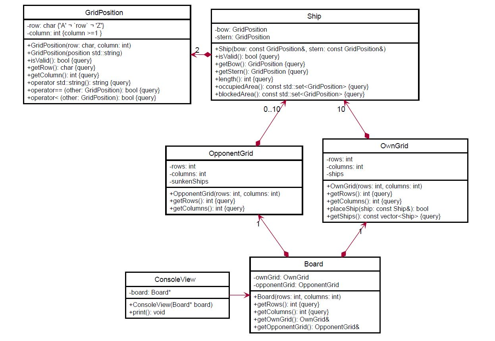
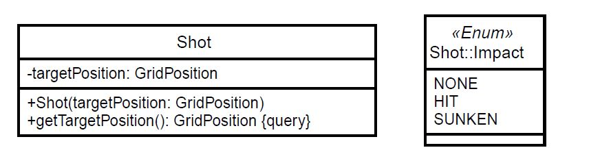
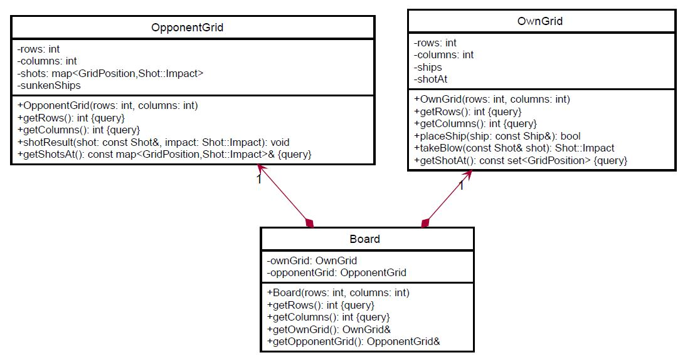

# Battleship Board Game

This assignment is about creating an OO model of the game [Battleship] (https://en.wikipedia.org/wiki/Battleship_(game). 
The goal for the initial version of the program is to replace the sheet of paper, i.e. a player can use the program to arrange his ships, keep track of the opponent’s shots, and keep track of the results of his own shots. You won’t implement a multi-player game. 
The user of this program will still have to talk to his opponent, who can continue to use a sheet of paper.

Contrary to games such as Reversi, the state of a game such as Battleship cannot be represented by the state of the fields on the board only, because we have to find out about such things as the distance of ships and the number of ships (when arranging the own ships on the board) or whether
a hit is a final hit, i.e. sinks the ship.

## Exercise 1: Basic classes

The most basic class represents a grid position, i.e. a row and a column on the board. The class is immutable. Once an object is created, its state cannot be modified.
A GridPosition can be created from individually specified row and column arguments or from a string such as "B10".
Because we have to create an object no matter what arguments are passed to the constructor (e.g. '@' and -15) the created object may have invalid values in its data members. The validity can be
checked by calling isValid. The method checks that 'A' ≤ row ≤ 'Z' and column > 0. (You’ll learn about a better way to handle such a situation later during this course.)
The overloaded cast to string returns the concatenation of the row and the column (e.g. "B10").
The behavior of the equals operator should be obvious. The less than operator assumes the fields to be ordered from top left to bottom right (e.g. A1 … J10). We need the less than operator for a very
specific reason. Once you have found out why, add the reason to the documentation of the method.




A ship has as data members two grid fields, named bow and stern. Of course, the two are indistinguishable when looking at the ships' representation on the paper. But these names are
better than "end1" and "end2" or something alike.
Just like GridPosition, class Ship is immutable. The values for bow and stern are passed to the constructor as arguments. Again, it is possible to invoke the constructor with illegal values.
Method isValid checks if the grid positions for bow and stern are valid, whether the ship is positioned horizontally or vertically and whether the length is between 2 and 5. 
Member function length returns the length of the ship, calculated from the distance between bow and stern.
The method occupiedArea returns all grid positions that are occupied by the ship. If e.g. the ship’s bow is at B2 and its stern at E2, then the function return B2, C2, D2, E2. The method blockedArea will
be explained later in the next sections.
Note that the classes GridPosition and Ship are described completely in the class diagram.
You may not add any members. The other classes are incomplete. You have to find out about e.g. the types of some data members and maybe add member functions due to the requirements following.

In the initial phase of the game, a player arranges the ships on his own grid by calling placeShip (ignore the return value for now). The opponent grid is used to track the player’s interaction with 
the opponent. It holds e.g. the information about the ships that have been sunken. Of course, initially, when the game starts, there are no sunken ships.
Both grids are part of the Board which models the game from one player’s perspective (it would be silly to call this class "Sheet" although it effectively models the sheet of paper that you use when
playing the game in the "analog" world). In order to be able to adapt to the different board sizes mentioned in Wikipedia, the number of rows and columns can be specified when creating the board.
Apart from returning the specified dimensions, Board's only capabilities are to provide access to the grids using the getter-functions.

## Exercise 2: Display and Arrangement rules

### 2.1 Display

The class ConsoleView shows the current state of the board on the Console. It obtains the
information about the state of the game from Board and writes it to the console. Initially, it is
sufficient to properly display the arranged own ships and prepare the display of the opponent grid.
The recommended approach for implementing the print method is to allocate a char array for each
grid, use the information from each grid to fill the char arrays and output the char arrays. Defining
private helper methods may simplify this task significantly. Of course, you are free to choose a
different approach.
To check you implementation, create an instance of Board (10 by 10), arrange three ships on the
board (B2/B4, D4/G4, F6/F9), create a console view and invoke print.

Here is the sample output for this board


```
                    1                      1
  1 2 3 4 5 6 7 8 9 0    1 2 3 4 5 6 7 8 9 0
A . . . . . . . . . .  A . . . . . . . . . .
B . # # # . . . . . .  B . . . . . . . . . .
C . . . . . . . . . .  C . . . . . . . . . .
D . . . # . . . . . .  D . . . . . . . . . .
E . . . # . . . . . .  E . . . . . . . . . .
F . . . # . # # # # .  F . . . . . . . . . .
G . . . # . . . . . .  G . . . . . . . . . .
H . . . . . . . . . .  H . . . . . . . . . .
I . . . . . . . . . .  I . . . . . . . . . .
J . . . . . . . . . .  J . . . . . . . . . .

```


### 2.2 Arrangement rules
Up to now, we haven’t checked whether the arrangement of the player’s own ships is legal. We apply the rules from the [German battleship version] (https://de.wikipedia.org/wiki/Schiffe_versenken).

1. Ships may not touch each other
2. The grid fields occupied by a ship form a straight line
3. Ships may be positioned at the edges of the grid
4. Ships must be positioned horizontally or vertically
5. Each player has 10 ships as follows:

|  Ship class  |  Length | Number of ships |
| :---------:  | :------ | :------- |
|    Carrier    |	5	 | 1 |
|    Battleship |	4	 | 2 |
|    Destroyer  |   3	 | 3 |
|    Submarine  |	2	 | 4 |


Check all conditions in OwnGrid::placeShip. Return false if a condition is violated.
The most difficult to check condition seems to be the first. Actually, it is quite simple if you use set theory. Implement the method Ship::blockedArea. It returns the set of grid positions occupied by the
ship and all surrounding grid positions. This set can be calculated easily from the occupied area:
1. Start with an empty result set
2. For each grid position from occupied area
	a. add the position and all eight surrounding positions to the result

Having occupiedArea and blockedArea available, the "ships mustn’t touch" rules comes down to 
1. For a ship to be placed on the grid check
	a. for each ship already on the grid that
		i. the intersection of the already placed ship’s blocked area and the new ship’s occupied area is the empty set.

To check the number of ships of a given length use the following approach:
1. Create a map<int,int> that you initialize with the pairs "length"/"number of ships" from the table above.
2. Each time to want to add a new ship with a given length
	a. check if the value associated with the length is greater zero and
	b. decrement the value associated with the given length
	
Provide tests for the alignment rules following the pattern outlined by the tests provided for exercise 1.

## Exercise 3: Shots

Now we add the class Shot to the model



Add the method Shot::Impact takeBlow(const Shot& shot) to OwnGrid.



If the shot doesn’t hit a ship, the value Shot::Impact::NONE is returned. If a ship is hit, Shot::Impact::HIT is returned.
If the hit is the final hit, i.e. the ship is sunk by the hit, Shot::Impact::SUNKEN is returned.
To detect a hit, iterate over all ships and check if the target position is a member of the occupied positions.
To detect the final hit, check the intersection of the ship’s occupied fields and all taken blows before the current one. If the size of the intersection is
one less than the length of the ship, the current hit is the final one.
Provide tests for shots (misses, hits, final shots) following the pattern outlined by the tests provided for exercise 1.
Update the class ConsoleView to also show the misses (use a circumflex instead of the dot) and the hits (use an 'O' instead of the sharp).

Here is the sample output for the board after shooting at B3, B4 and B5: 

```
                    1                      1
  1 2 3 4 5 6 7 8 9 0    1 2 3 4 5 6 7 8 9 0
A . . . . . . . . . .  A . . . . . . . . . .
B . # O O ^ . . . . .  B . . . . . . . . . .
C . . . . . . . . . .  C . . . . . . . . . .
D . . . # . . . . . .  D . . . . . . . . . .
E . . . # . . . . . .  E . . . . . . . . . .
F . . . # . # # # # .  F . . . . . . . . . .
G . . . # . . . . . .  G . . . . . . . . . .
H . . . . . . . . . .  H . . . . . . . . . .
I . . . . . . . . . .  I . . . . . . . . . .
J . . . . . . . . . .  J . . . . . . . . . .

```

Finally, we have to include the information about the opponent’s ships into our model. Add the method shotResult (as specified by the UML class diagram) to the class OpponentGrid.
The method adds the shot and its result to the data member shots and updates the list of sunken ships. Find out how to derive the information about whether a ship has been sunken by a shot and about
its bow and stern.
Add tests that confirm the working detection of sunken ships.
Again, update the implementation of ConsoleView::print to also display the information obtained about the opponent’s ships.

Here is the sample output for the board after having hit one of opponent’s ships twice and sunk
another one (and there were some misses, of course).

```
                    1                      1
  1 2 3 4 5 6 7 8 9 0    1 2 3 4 5 6 7 8 9 0
A . . . . . . . . . .  A . . . . . . . . . .
B . # O O ^ . . . . .  B . . . . . . . . . .
C . . . . . . . . . .  C . ^ # # # . . . . .
D . . . # . . . . . .  D . . . . . . . . . .
E . . . # . . . . . .  E . . . . . . . . . .
F . . . # . # # # # .  F . . . . ^ . . . . .
G . . . # . . . . . .  G . . . ^ O O . . . .
H . . . . . . . . . .  H . . . . . . . . . .
I . . . . . . . . . .  I . . . . ^ . . . . .
J . . . . . . . . . .  J . . . . . . . . . .

```

