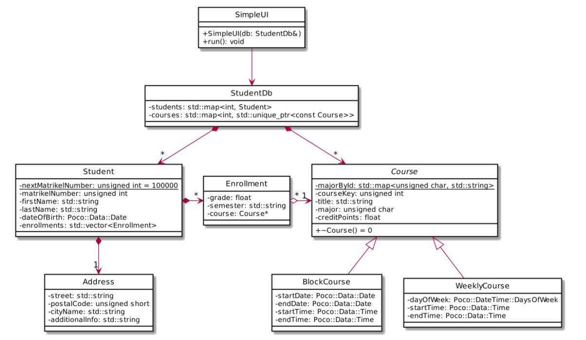

# Student Database


These are the classes and their data members used in this exercise.



Define constructors and getters as required. Try to keep the classes immutable, i.e. define setter functions only if required for the use cases described below.

Remember the storage space optimization in Course: the property major is stored internally as a char and mapped to a string using the static data member majorById. Thus although the class uses
only a character for storing the major, it accepts a std::string for the major in its constructor and provides a getter function std::string getMajor(), the optimization is completely hidden from the
user of the class.

Matrikel numbers for new students are generated automatically. Each time a new student is created, the value from class member nextMatrikelNumber is used, which is incremented afterwards.

The class SimpleUI provides a simple user interface for the database. It is created with the student database as argument. The run method continuously lists the available commands, waits for the
user to choose one by entering the number and executes the command. Command execution may involve further data input from the user, of course.

The commands to be implemented are:
1. Add new Course: Queries the user for the required data and creates the new course in the database.
2. List courses: Prints all courses in the database with their data.
3. Add new student: Queries the user for the required data (member data of Student and Address) and creates a new student in the database.
4. Add enrollment: Queries the user for a matrikel number, a course id and a semester and adds the enrollment. If the enrollment already exists, a warning messages is printed.
5. Print student: Queries the user for a matrikel number and prints the student including the enrolled courses and their results.
6. Search student: Queries the user for a string and prints the matrikel number, last name and first name of all students that have the provided string as substring in their first or last name.
7. Update student: Queries the user for a matrikel number. If the corresponding student is found in the data base, the properties (except for the matrikel number) are presented in a numbered list.

Entering the item number allows the user to modify the property, entering "0" terminates the update.
The list of properties also includes the enrollments. When an enrollment is chosen for update, the user can remove the enrollment or enter a mark for the enrollment.
Remember that Address is immutable, as discussed in the lecture. If any property of the address is changed, a new object must be created.
There’s no prescribed format for the output of data. However, although this is only a user interface for testing purposes, you should keep usability in mind and format any output accordingly.
Create a StudentDb and a SimpleUI in main and test the implementation.

## Exercise 2: Persisting the database

Write the database content to a file. The file format is derived from the commonly used [CSV format](https://en.wikipedia.org/wiki/Comma-separated_values).
In order to store all data in one file, we first write a line with the number of data sets of a given kind and then all data sets, using a semicolon to separate the values. The file starts with the courses,
followed by the student data (Student's data members and address data), followed by the enrollment data.
Here’s a short example:

```

2
W;5387;APT;Automation;5;3;17:45;19:15
B;2371;C Programming;Automation;5;16.9.2019;20.9.2019;14:15;19;15
2
100000;Olsen;Peter;23.11.1998;7158 Spurvevej;21361;Juelsminde;
100001;Stein;Josephine;5.3.1997;2575 Tannenweg;49733;Delitzsch;Apartement 6b
1
100000;5387;WS2018;2.3

```

Implement writing by adding methods virtual void write(std::ostream& out) to Course and Student. Objects write a single line with their data to the ostream. The classes BlockCourse and
WeeklyCourse write a character indicating the actual type followed by the data members of the base class and the derived class. Implement this by implementing Course::write in such a way that it
writes the base class’s data without a line terminator (e.g. “5387;APT;Automation;5”) and call this method from the derived classes after writing the leading type indicator and before writing the
data members of the derived class.
Finally add void write(std::ostream& out) to StudentDb. It calculates the number of items to write for each kind and invokes the write method for each of the items.
Of course, we also want to read back the data. Add a method void read(std::istream& in) to StudentDb that clears the database and then restores the content from the data in the file. Make sure
that nextMatrikelNumber has the highest matrikel number plus one when all data has been processed.
Add commands for reading and writing to the SimpleUI. The command queries the user for a file name, creates the file stream and invokes the read and write methods respectively.

## Exercise 3: Obtaining test data
Host "mnl.de" provides on port 4242 a service for obtaining sample user data. It’s usage is basically similar to the usage of the time service shown in the lecture, with the exception that commands
have to be sent in order to receive data.
The server understands two commands generate and quit. Here’s a sample session with the data sent (→) and received by the client (←).

|    |   |
| :---------: | :------- |
|     →     |	generate	|
|     ←     |	100 Generating	|
|     →     |	{"cell":"(807)-365-2612", …	|
|     ←     |	200 Data generated.	|
|     →     |	quit	|
|     ←     |	200 Closing connection. Bye bye!	|

Use a Poco::Net::SocketStream for the connection to the server. Once established, it can be used like any other std::iostream.
Note that the server has a timeout of 5 seconds. If no command is received within this time span, the connection is closed automatically

The generated data is provided in the [JSON format](https://en.wikipedia.org/wiki/JSON). Here’s a formatted sample output (picture data omitted):

```
{
	"cell": "0176-0485326",
	"dateOfBirth": {
		"date": 7,
		"day": 2,
		"hours": 22,
		"minutes": 7,
		"month": 0,
		"seconds": 13,
		"time": -914557966854,
		"timezoneOffset": -120,
		"year": 41
	},
	"email": "josefine.stein@example.com",
	"gender": "female",
	"location": {
		"city": "delitzsch",
		"postCode": "49733",
		"state": "sachsen-anhalt",
		"street": "2575 tannenweg"
	},
	"name": {
		"firstName": "josefine",
		"lastName": "stein",
		"title": "mrs"
	},
	"nationality": "DE",
	"phone": "0560-8157618",
	"picture": "...",
	"registrationDate": {
		"date": 12,
		"day": 4,
		"hours": 22,
		"minutes": 7,
		"month": 10,
		"seconds": 13,
		"time": 721602433146,
		"timezoneOffset": -60,
		"year": 92
	}
}
```

The Poco library provides classes for parsing this data.
Add another command to the test menu for the StudentDb that queries the user for the number of students to add. When executing, the command connects to the server, issues the generate and
creates new student records using the data received. This is repeated as often as required.
Be nice, terminate the session with the server by sending the quit command rather than relying on the connection timeout


