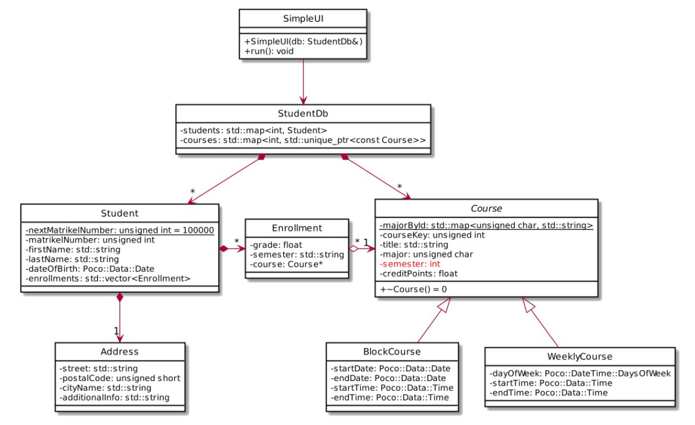

# Student Database - Add attribute semester to Class Course (Module Exam WiSe2021)

This folder is an extension of [03_Lab_Student_Database](https://github.com/kpriyaGit/Cpp/tree/main/01_CourseModule/03_Lab_Student_Database)

A course takes place in a particular semester. It therefore makes sense to add this information as an attribute semester in class Course.



## 1.1 Extended constructor and getter

While the attribute has the characteristics of a string (“WiSe2021”, “SoSe2022”, “WiSe2022”, …) an integer value is used for storage efficiency and the mapping takes place in the constructor and the getter
method.
Add the private attribute in the class definition and extend the constructor and implement the getter method as specified below. Because the attribute was introduced in WiSe2021, this particular semester
is mapped to 0. However, in order to be able to also handle historical data, the methods must handle negative values correctly (e. g. “SoSe2021” must map to -1).


```
class Course {
/**
* ...
*
* @param semester the semester in the format "WiSe2021", "SoSe2022",
* "WiSe2022" etc. Case is not checked, i.e. "wise2021" or even "wISe2022"
* are acceptable values
* @throws invalid_argument if the argument violates the proper format
*/
Course (...);
/**
* Returns the semester in which the course takes or took place as an
* abbreviated string in the format "WiSe2021", "SoSe2022", "WiSe2022" etc.
*
* @return the semester
*/
std::string getSemester() const;

```
Adapt the constructors of BlockCourse and WeeklyCourse as required.
Adapt SimpleUI, write and read methods as required. (The new information must be added to the CSV file.)

## 1.2 Systematic Testing

 Use asserTrue() to write test cases.
```
/**
 * Outputs the failedMessage on the console if condition is false.
 *
 * @param condition the condition
 * @param failedMessage the message
 */
inline void assertTrue(bool condition, string failedMessage){
	if (!condition) {
	        cout << failedMessage << endl;
	    }
}

```

1. Test (with all semesters from SoSe2020 to WiSe2023) that a WeeklyCourse with the given semester returns the proper result in its getSemester-method. At least two test cases should
use strings where upper and lower case deviate from the standard usage (which is “WiSe” or “SoSe”).

2. Test that “Some2022” and “WiSe20/21” yield an exception.

## 1.3 Consistency check

In the method in which you add a new enrolment for a student, verify that the student is not enrolled
twice in the same course. It is left to you to decide how you signal an error condition to the invoker.

