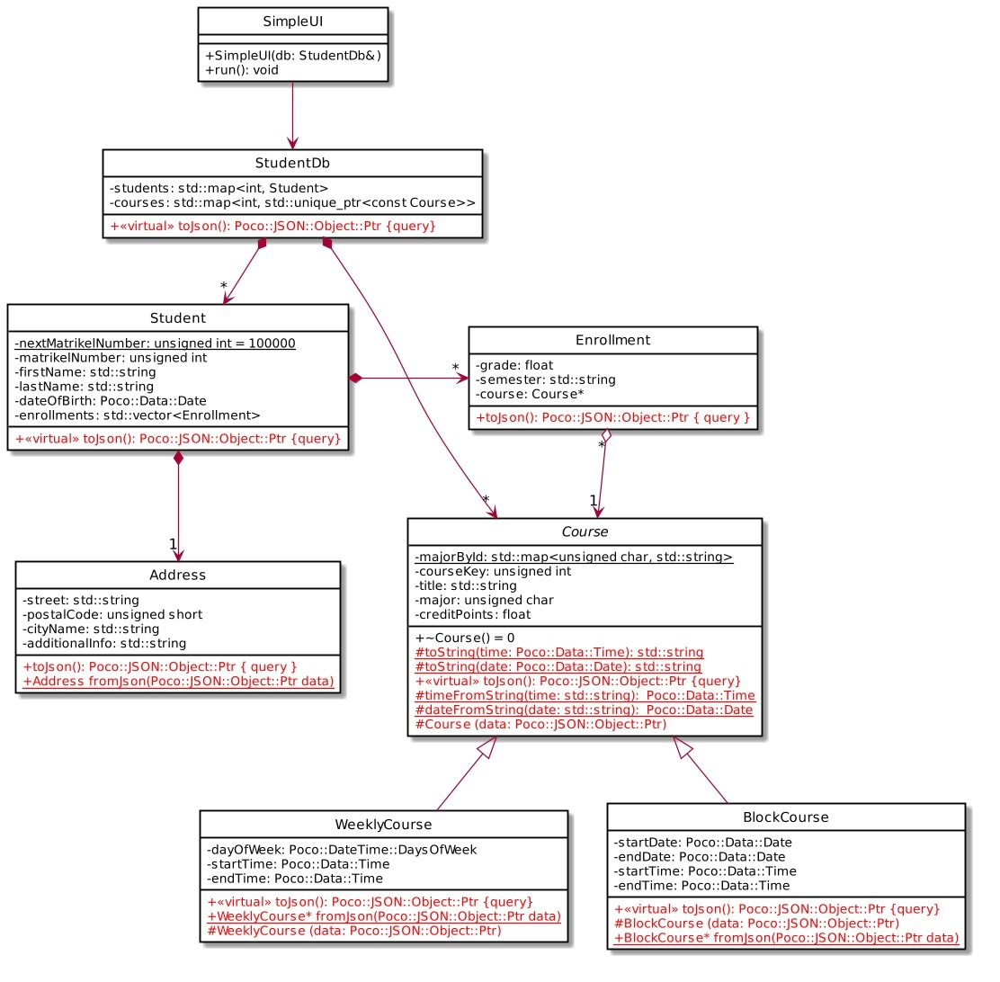

# Student Database - JSON persistence for the database (Module Exam WiSe2021)

This folder is an extension of [03_Lab_Student_Database](https://github.com/kpriyaGit/Cpp/03_Lab_Student_Database)

In order to store the data from our student data base in CSV-format, we had to “violate” that format quite
a bit (by using different numbers of columns for the lines in the file). CSV is not well suited to represent
structured data from different items. However, as you have seen when retrieving person data from the
server, JSON is well up to that task.

Therefore we now want to implement persistence for the database using the JSON format.



## 2.1 Writing the data

The easiest approach to writing the JSON data with the POCO library library is to first create a JSON tree that represents the data and then write it to a file using the readily available method.

Each class should be responsible for creating the “sub-tree” that represents its data. The class that contains other classes is responsible for combining the sub-trees
provided by the contained objects into a larger sub-tree. The StudentDb eventually provides the tree that represents all data.

Declare and implement the new methods (shown in red) in the class diagram. Here are some hints:

• Implement the methods “bottom up”, i. e. start with sub-trees that don’t contain other objects (except std::string).

• Address::toJson() is a “simple” method. It returns a JSON object with the keys identical to the attribute names and the values taken from the current values of the attributes. Example
result:
```
{
	"additionalInfo" : "",
	"cityName" : "Sometown",
	"houseNumber" : "42a",
	"postalCode" : 1000,
	"street" : "Mainstreet"
}

```

• Course::toJson() returns a JSON object with the properties of the base class. The derived classes should call the method implementation of the base class and add their specific attributes.

• WeeklyCourse::toJson() and BlockCourse::toJson() pose a small challenge. They have attributes of type Poco::DateTime::DaysOfWeek, Poco::Data::Time and
Poco::Data::Date. Values of these types cannot simply be added to a JSON::Object, because JSON does not define a string representation for these types. You have to convert the
values as follows:

	◦ Poco::DateTime::DaysOfWeek is an enum and can be cast to an int.
	
	◦ Poco::Data::Time is converted to a string “hh:mm” (make sure to generate any leading 	zero(es), this make parsing the string representation easier).
	
	◦ Poco::Data::Date is converted to a string “dd.mm.yyyy” (make sure to generate any leading zero(es), this make parsing the string representation easier).
	
	◦ In order to avoid duplicating code for the last two conversions, add protected (class) methods for the conversion in class Course.
	
Using this approach, the JSON for a weekly course may look like this:

```
{
	"courseKey" : 12345,
	"creditPoints" : 5,
	"dayOfWeek" : 4,
	"endTime" : "19:00",
	"major" : 65,
	"startTime" : "17:45",
	"title" : "APT"
}

```

• Enrollment::toJson() cannot store the pointer to Course as value, it writes the value of the courseKey to JSON instead.

Output the resulting JSON to a file. Here’s an example with one course and one student:

```
{
"courses" : [
		{
		    "courseKey" : 12345,
		    "creditPoints" : 5,
		    "dayOfWeek" : 4,
		    "endTime" : "19:00",
		    "major" : "A",
		    "startTime" : "17:45",
		    "title" : "APT"
		}
	],
"students" : [
		{
		    "address" : {
		    	"additionalInfo" : "",
			"cityName" : "Sometown",
			"houseNumber" : "42a",
			"postalCode" : 1000,
			"street" : "Mainstreet"
			},
		    "enrollments" : [
					{
					    "courseKey" : 12345,
					    "grade" : 0
					}
				   ],
		    "firstName" : "Muster",
		    "lastName" : "Mann",
		    "matrikelNumber" : 1234567
		}
	]
}

```

## 2.2 Reading the data

Of course, writing the data as JSON only makes sense if you can also restore the data from the JSON representation. Implementing this is not as easy at it might seem. We’ll therefore focus on restoring
Address (as a very simple case) and WeeklyCourse/ BlockCourse (as a more challenging case).

• Address::fromJson is a class method that returns a new Object of type Address with retrieved from the given JSON object. The JSON object may be assumed to be correct, i. e. the
required key/value pairs exist.

• WeeklyCourse::fromJson and BlockCourse::fromJson work a bit differently. Because the invoker cannot know if the JSON object represents a weekly course or a block course, these methods return pointers to the result types. The respective method implementations first check
(by looking at the keys of the JSON object) if the JSON object represents an object of their type. If so, they return a new object allocated on the heap, else they return nullptr. (Note: for this exercise, it is sufficient to verify the existence of a single, distinctive key.)

Another challenge is to avoid duplication of the code that extracts the values of the base class from the JSON. This can be done by defining protected constructors that take the JSON object
as a parameter. The base class extracts the values that it is interested in, the derived classes extract the remaining values.

Again, add protected methods to Course that provide the required conversion from the string representation of Poco::Data::Date and Poco::Data::Time to the respective types.

