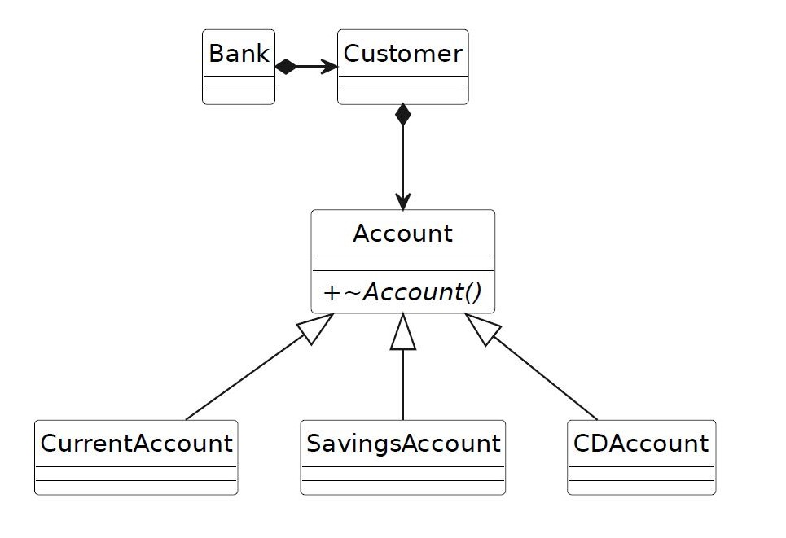

# Bank Model (Module Exam WiSe2022)

Topic of this exam is the modelling of some data related to customers of a bank (see picture below). A
bank has customers who have one or more accounts. Accounts can be of different type. The current
account (a.k.a. checking account, German: Girokonto), usually only used for transferring money. A
savings account (German: Sparkonto) that earns interest on the money deposited in it. A certificate of
deposit (CD) account (German: Festgeldkonto) that earns higher interest if you leave your money in the
account for a fixed term.

The diagram shows only the classes and their relationships. The attributes and methods are found in the class definitions.

## 1. Exercise

Implement the classes and their methods as described in the header files.

Adding private methods in order to avoid redundant code is allowed. Adding to or modifying the classes’ attributes is forbidden.
Adding to or modifying the public or protected methods is forbidden as well. 
Implement the tests outlined in file “test.cpp”. Note that “assert that …” means that you have to write one or more assertTrue(...)-statements. 
Unless there is an error, running your tests must not produce any output on the console.