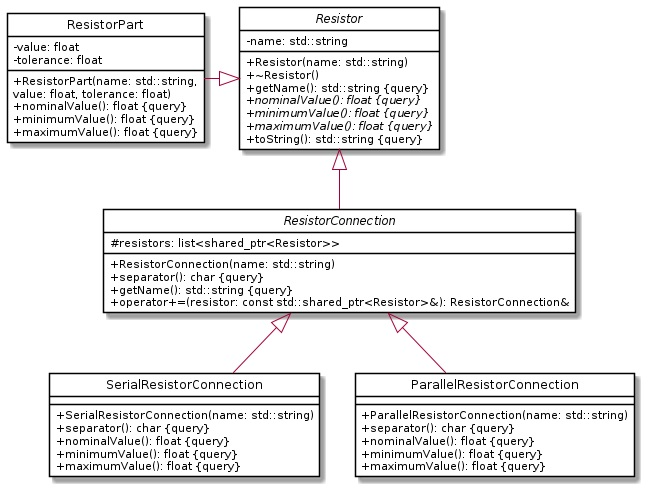

# Resistor Network (Module Exam sommer Semester 2022)

Topic of this exam is the modelling of resistor networks (see picture below). The general interface to any
resistor network is specified by class Resistor. An instance may simply be a physical resistor (class
ResistorPart). Another possibility is to have a connection of two or more resistors, either a serial
connection or a parallel connection



## Exercise 1

a) Define class Resistor and implement its methods. The destructor does nothing, but defining it avoids a compiler warning and is best practice for abstract classes. The method
toString returns the result from invoking getName() and nominalValue() formatted as: “<name>=<value> Ohm”, e. g. “R1=42 Ohm” (no line break) (see sample output below).
To save you a lot of typing, add a line “typedef std::shared_ptr<Resistor> ResistorPtr;” in the header file. It allows you to use ResistorPtr wherever you’d have
to write std::shared_ptr<Resistor> without the typedef.

b) Define class ResistorPart and implement its methods.

c) Overload the <<-Operator for ostream and Resistor in Resistor.h and Resistor.cpp in such a way that it writes the result of calling toString() (invoked
using dynamic polymophism) to the given ostream.

d) Test your implementation by creating (in main.cpp) a resistor named R1 with a value of 42 Ω and 5% tolerance and writing it to the console.

e) Define class ResistorConnection and implement its methods. The method separator() returns “,” (comma), it will be overridden by derived classes. The method getName() invokes
the method getName() of the base class and appends the names of the connected resistors as a list in square brackets, using the value from invoking separator() as
separator. E. g. if R1 connects the resistors R2 and R3 then getName() returns “R1[R2,R3]”. The overloaded +=-operator appends the given resistor to the list of connected
resistors.

f) Define class SerialResistorConnection and implements its methods. The method
separator() returns “-” (a dash). The calculation of the nominal, minimum and maximum
value of a series connection of resistors should be obvious.

g) For testing your implementation create (in main.cpp) a serial connection named R2 which
connects a resistor named R3 (1 kΩ, 10%) and a resistor named R4 (4.7 kΩ, 10%) and
write it to the console (see sample output below).

h) Define class ParallelResistorConnection and implements its methods. The method
separator() returns “|” (a vertical bar). The calculation of the nominal, minimum and
maximum value of a parallel connection of resistors should be obvious.

i) For testing your implementation create (in main.cpp) a parallel connection named R5
which connects a resistor named R6 (1 kΩ, 10%) and a resistor named R7 (4.7 kΩ, 10%)
and write it to the console (see sample output below).

```
R1=1000.000000 Ohm
R2[R3-R4]=5700.000000 Ohm
R5[R6|R7]=824.561340 Ohm
```

## Exercise 2

Add methods for writing a resistor network to a file and restoring it from a file.
The format used is CSV with a semicolon as separator. The following fields are used:
	1. Name
	2. Nominal Value
	3. Tolerance
Sample:

```
R3;1000;0.1
R4;4700;0.1
R2[R3-R4];5700;0.1
R6;1000;0.1
R7;4700;0.1
R5[R6|R7];824.561;0.1
```

a) Add method “void write(ostream& out)” (dynamic polymorphism) to the class Resistor. The value for tolerance is calculated from the results of invoking nominal-,
minimal- and maximumValue (how to do this should be obvious, considering the implementations of these methods in ResistorPart).

b) Redefine method “void write(ostream& out)” in class ResistorConnection.
This implementation first invokes write for each connected resistor and then the write method of the base class. This sequence ensures that all resistors appear in the output
before being referenced by another resistor (of type ResistorConnection).

c) Test your implementation by writing R2 and R5 from the previous exercise to a file “data.txt”.

d) Reading resistor networks is a bit more difficult. After reading a line, you look at the first field (name). If the name does not contain a square bracket, it’s a ResistorPart and
you use the remaining data to create it. Else, it’s a ResistorConnection and you ignore the remaining fields. You can deduce from the name (have a look at the separator)
if it is a serial connection or a parallel connection and which resistors are connected. But how can you add the referenced resistors to the connection? Well, due to our writing
strategy, the connected resistors always appear in the input before a connection that references them. So the reading strategy is to put newly created resistors in a map (by
name). When they are later referenced by a connection, they are added to the connection and removed from the map. At the end, the map only contains the “top level” resistor
networks.

e) Define a new class ResistorReader with a public class method “void read(std::istream& in, std::map<std::string, ResistorPtr>& found)”.
It’s implementation basically consists of a loop that reads lines from the input and handles them. As a first step, implement the loop and detect if a line represents a ResistorPart
or a resistor connection.

f) Add a public class method “ResistorPtr from(std::string line)” to class ResistorPart. It accepts a line (as read from the file) that describes a resistor part and
creates a new instance initialized with the data from the line. Invoke this method in ResistorReader::read if you have detected that the line read describes a resistor part
and add the newly created object to the map “found”.

g) Continue the implementation of the read method in ResistorReader. If the line does not describe a resistor part, obtain the information about the kind of circuit and the
connected resistors from the name field of the line and create (and add to “found”) an instance of SerialResistorConnection or ParallelResistorConnection as
appropriate. As described above, you’ll find all referenced resistors (the ones enumerated within the square brackets) in “found”. Remove them from the map and add them to the
connection. Add the newly created instance to “found”.

h) Test your implementation by reading (in main) from “data.txt”. Output the resistor networks in the map after reading.

