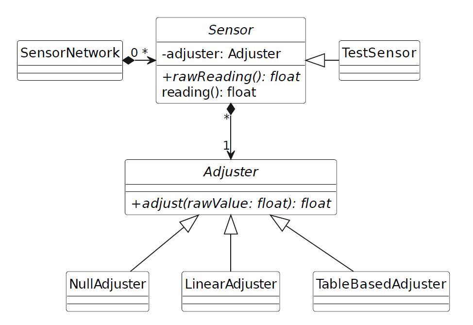

# Sensor Network model (Module Exam Summer Semester 2023)

Topic of this exam is the (partial) modelling of a sensor network

The diagram shows only the classes and their relationships. The attributes and methods are found in the class definitions.

## 1. Exercise

Implement the classes and their methods as described in the header files.

Adding private methods in order to avoid redundant code is allowed. Adding to or modifying the classes’ attributes is forbidden.
Adding to or modifying the public or protected methods is forbidden as well. 
Implement the tests outlined in file “test.cpp”. Note that “assert that …” means that you have to write one or more assertTrue(...)-statements. 
Unless there is an error, running your tests must not produce any output on the console.

The Illustration mentioned in TableBasedAdjuster::adjust:

